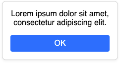

## Description

Inline styles allow you to attach style rules to individual DOM elements. It is not common to use inline styles as the primary styling method for an application because they result in suboptimal performance and do not support every CSS feature (e.g. pseudoselectors like `:hover`). That said, inline styles are by far the best way to apply _dynamic_ styles like the `transform` property of a draggable element.

The syntax for inline styles differs between HTML and React. In HTML, you would write the styles as a semicolon-delimited string:

```html
<div style="background-color: purple; padding: 1rem"></div>
```

while in React, you pass an object to the `style` prop:

```jsx
return <div style={{ backgroundColor: 'purple', padding: '1rem' }} />;
```

When using the `style` prop, the keys must be in `camelCase` rather than `kebab-case`. This is because React applies your styles to the element using the `HTMLElement.style` property of the DOM. This means that, for the code above, React will do the equivalent of:

```jsx
div1.style.backgroundColor = 'purple';
div1.style.padding = '1rem';
```

where `div1` is the DOM element created by the JSX.

## Purpose and Use Cases

As stated above, inline styles are not typically used as the main way to style an application. Inline styles are the best option when dealing with dynamic styles, where a style is considered dynamic if either of the following are true:

1. The style will change frequently, e.g. the `transform` rule for an element that can be dragged across the screen.
2. There is a collection of many DOM elements and the style is different for each element. This could arise, for instance, if you are displaying a grid of user profile pictures and using `background-style: url(...)` to show the correct picture in each circle.

Inline styles can also be a more convenient alternative to traditional CSS when a style depends on a JavaScript variable. For example, you may want to set `visibility` to `hidden` whenever the React component's `currentUser` prop is `null`. Scenarios like this can be often be handled with traditional CSS by conditionally applying a class name, though this is less direct than simply setting `style={{ visibility: currentUser ? 'visible' : 'hidden' }}` in your JSX code.

## Tradeoffs

Inline styles do not support all features of CSS. Unsupported features include:

- Pseudoselectors like `:hover` and `:focused`
- Pseudoelements like `::before` and `::after`
- Media queries, e.g. `@media (min-width: 600px) { ... }`, which are required for responsive design
- The `@keyframes` rule which is used to define animations

Inline styles are also generally [less performant](https://simonadcock.com/are-inline-styles-faster-than-atomic-css) than plain CSS, though the difference is not large enough to matter if inline styles are used sparingly.

Inline styles can result in duplicate code, though this can be addressed by sharing styles via component reuse or importing/exporting shared style objects.

## When Should I Consider Using This?

- The style you want to apply changes frequently, varies from one element to the next, or is controlled by a JavaScript variable.
- The number of elements is small enough that the performance penalty incurred by inline styles will not be noticeable.
- You want a quick way to test out different styles during development.

## Further Information

- [Are inline styles faster than atomic CSS?](https://simonadcock.com/are-inline-styles-faster-than-atomic-css) by Simon Adcock.
- [Inline Styles in HTML](https://www.codecademy.com/article/html-inline-styles) by Codecademy.

## Example

This example shows how to create the following component using React and inline styles.



All of your code will go in the React JSX — there is no need for an external CSS file. Instead of adding class names to elements, you'll pass your styles directly into the `style` prop. In the code below, we've made it so the button's color changes each time you click it as a fun way to demonstrate the dynamic nature of inline styles.

```jsx title="Card.jsx"
export function Card() {
  const [hue, setHue] = useState(0);

  return (
    <div
      style={{
        border: '1px solid #ccc',
        boxShadow: '0 0.125rem 0.25rem rgba(0, 0, 0, 0.075)',
        borderRadius: '0.5rem',
        padding: '1rem',
        maxWidth: '200px',
      }}
    >
      <div style={{ marginBottom: '1rem' }}>
        Lorem ipsum dolor sit amet, consectetur adipiscing elit.
      </div>
      <button
        onClick={() => setHue((h) => (h + 25) % 360)}
        style={{
          border: 0,
          backgroundColor: `hsl(${hue}, 100%, 70%)`,
          color: 'white',
          padding: '0.5rem',
          fontSize: '1rem',
          borderRadius: '0.25rem',
          width: '100%',
        }}
      >
        OK
      </button>
    </div>
  );
}
```
